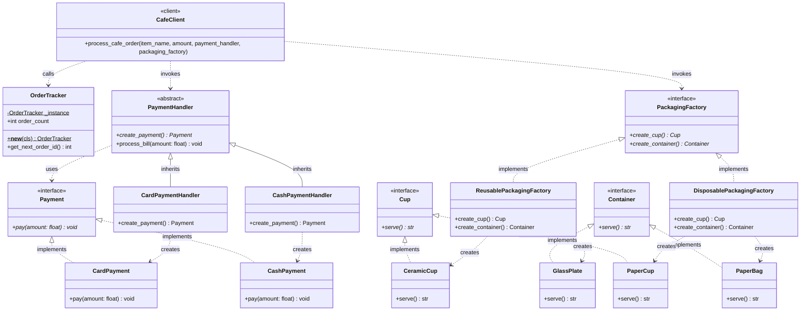
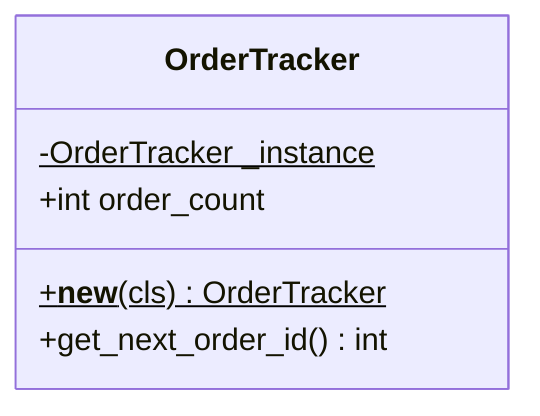
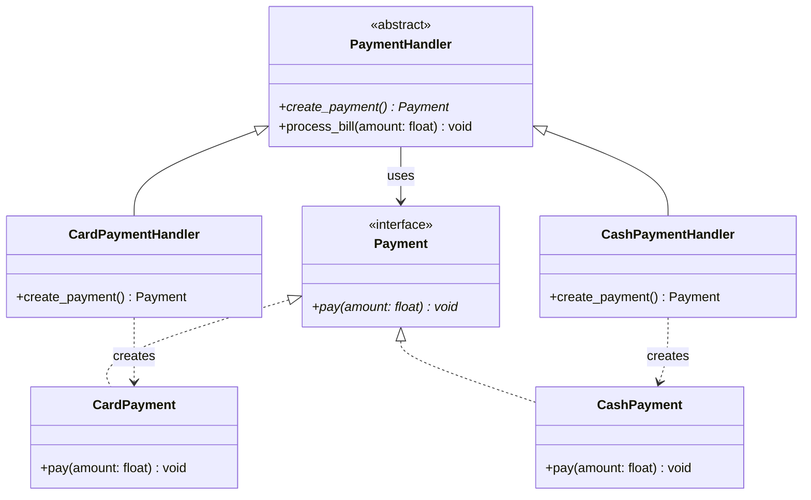
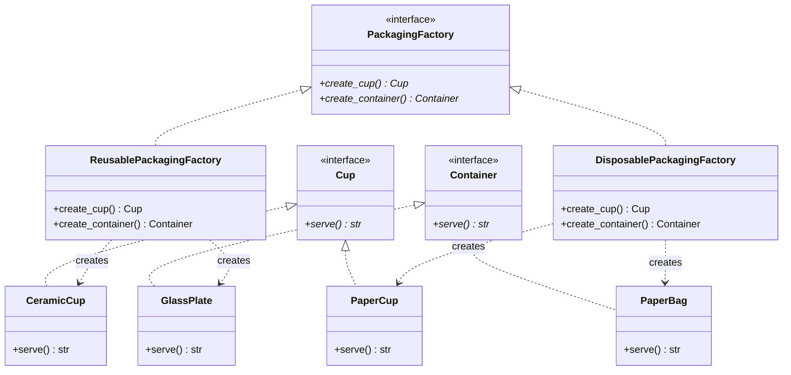

# Class Diagram Specification

## System: Cafe Order Management System

**Patterns Demonstrated:** Singleton, Factory Method, Abstract Factory

---

## 1. Unified Class Diagram (Complete System)

---

## 2. Pattern-Specific Class Diagrams

### 2.1 Singleton Pattern (`OrderTracker`)

---

### 2.2 Factory Method Pattern (`PaymentHandler`)

---

### 2.3 Abstract Factory Pattern (`PackagingFactory`)

---

## 3. Relationship & Multiplicity Summary

| Source Class                 | Target Class       | Relationship Type                      | Notation | Description                       |
| :--------------------------- | :----------------- | :------------------------------------- | :------- | :-------------------------------- |
| `CardPaymentHandler`         | `PaymentHandler`   | Inheritance (Generalization)           | `--\|>`  | Extends base creator class        |
| `CashPaymentHandler`         | `PaymentHandler`   | Inheritance (Generalization)           | `--\|>`  | Extends base creator class        |
| `CardPayment`                | `Payment`          | Realization (Interface Implementation) | `..\|>`  | Implements payment contract       |
| `CashPayment`                | `Payment`          | Realization (Interface Implementation) | `..\|>`  | Implements payment contract       |
| `ReusablePackagingFactory`   | `PackagingFactory` | Realization (Interface Implementation) | `..\|>`  | Implements factory contract       |
| `DisposablePackagingFactory` | `PackagingFactory` | Realization (Interface Implementation) | `..\|>`  | Implements factory contract       |
| `CeramicCup` / `PaperCup`    | `Cup`              | Realization (Interface Implementation) | `..\|>`  | Implements cup interface          |
| `GlassPlate` / `PaperBag`    | `Container`        | Realization (Interface Implementation) | `..\|>`  | Implements container interface    |
| `CafeClient`                 | `OrderTracker`     | Dependency (Usage)                     | `..>`    | Retrieves next unique order ID    |
| `CafeClient`                 | `PaymentHandler`   | Dependency (Usage)                     | `..>`    | Delegates payment execution       |
| `CafeClient`                 | `PackagingFactory` | Dependency (Usage)                     | `..>`    | Requests matched packaging family |
