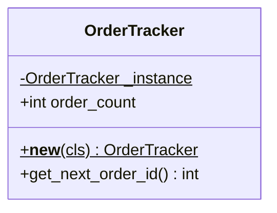
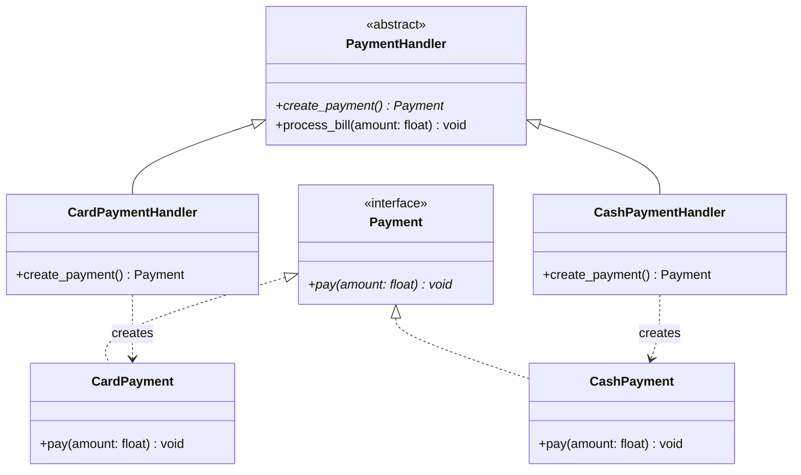
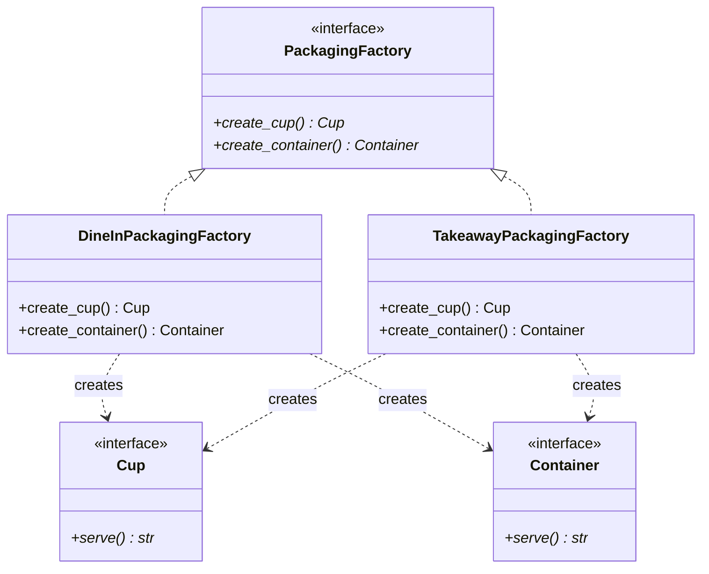

# UML Design Specification: Cafe Order Management System

## 1. Unified Conceptual Architecture

A single software application integrating **Singleton**, **Factory Method**, and **Abstract Factory** into one order processing workflow:

```
                          [ OrderTracker (Singleton) ]
                                       ^
                                       | (assigns order ID)
                                       |
Customer Order ------> [ process_cafe_order() ]
                             /                 \
                            /                   \
                           v                     v
            [ PaymentHandler ]            [ PackagingFactory ]
            (Factory Method)              (Abstract Factory)
             /            \                 /             \
            v              v               v               v
       CardPayment     CashPayment   DineInFactory   TakeawayFactory
                                           |                 |
                                     (creates Ceramic   (creates Paper
                                      Cup + Plate)       Cup + Bag)
```

---

## 2. Pattern-by-Pattern Sub-Diagrams

### 2.1 Singleton (`OrderTracker`)

```
Client A --------\
                  +------> [ OrderTracker ] (Single Global Counter)
Client B --------/
```



---

### 2.2 Factory Method (`PaymentHandler`)

```
PaymentHandler (Creator) ---------> Payment (Interface)
       ^                                    ^
       |                                    |
  +----+------------------+            +----+------------------+
  |                       |            |                       |
CardPaymentHandler  CashPaymentHandler  CardPayment        CashPayment
  |                       |
  v (creates)             v (creates)
CardPayment          CashPayment
```



---

### 2.3 Abstract Factory (`PackagingFactory`)

```
PackagingFactory (Interface) ------> Cup (Interface) + Container (Interface)
       ^                                    ^                    ^
       |                                    |                    |
  +----+--------------------+               |                    |
  |                         |               |                    |
DineInPackagingFactory  TakeawayPackagingFactory |               |
  |                         |               |                    |
  +---> CeramicCup          +---> PaperCup -+                    |
  +---> GlassPlate          +---> PaperBag ----------------------+
```


